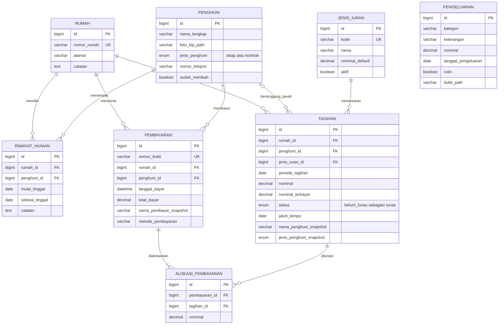

# Entity Relationship Diagram (ERD)

Nama tabel, kolom, relasi, dan nilai status pada data utama menggunakan Bahasa Indonesia agar mudah dipahami oleh pengelola aplikasi.

## Tabel teknis Laravel

Selain tabel bisnis di atas, Laravel memiliki tabel teknis seperti `users`, `personal_access_tokens`, `cache`, `jobs`, dan `migrations`. Nama tabel bawaan tersebut dipertahankan agar kompatibel dengan framework. Tabel teknis tidak termasuk dalam ERD bisnis karena tidak mewakili proses administrasi RT.

## Keputusan integritas data

- Status rumah dihitung dari ada atau tidaknya riwayat hunian aktif (`selesai_tinggal` kosong).
- Perpindahan penghuni menutup periode lama dan membuat periode baru; riwayat lama tidak ditimpa.
- Tagihan menyimpan snapshot nama dan jenis penghuni agar riwayat tetap benar setelah penghuni pindah atau datanya berubah.
- Satu rumah hanya memiliki satu tagihan untuk kombinasi jenis iuran dan periode yang sama.
- Satu pembayaran dapat dialokasikan ke banyak tagihan sehingga pembayaran satu tahun tetap tercatat per bulan.
- Pergantian penghuni di tengah bulan tidak mengubah penanggung jawab secara acak: penghuni pada hari pertama periode diprioritaskan, atau penghuni pertama pada bulan tersebut jika rumah sebelumnya kosong.
