# Rangkuman Screenshot Fitur

Seluruh screenshot menggunakan data demo administrasi perumahan. Setiap halaman utama ditampilkan dalam tampilan desktop dan mobile untuk memperlihatkan bahwa antarmuka tetap dapat digunakan pada ukuran layar yang berbeda.

## 1. Login Administrator

Halaman autentikasi administrator untuk membatasi akses ke pengelolaan data RT.

| Desktop | Mobile |
|---|---|
| 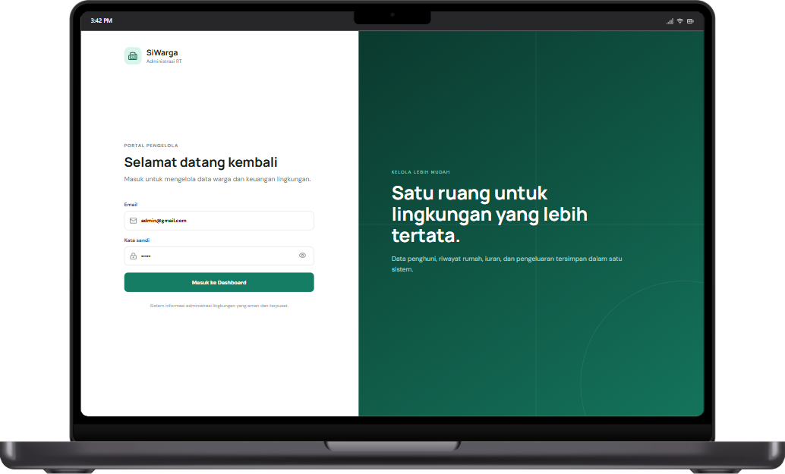 | 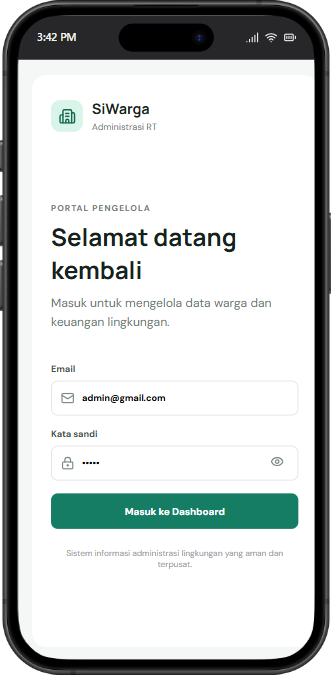 |

## 2. Dashboard

Ringkasan pemasukan, pengeluaran, saldo saat ini, jumlah rumah dihuni, dan grafik arus kas tahunan.

| Desktop | Mobile |
|---|---|
| 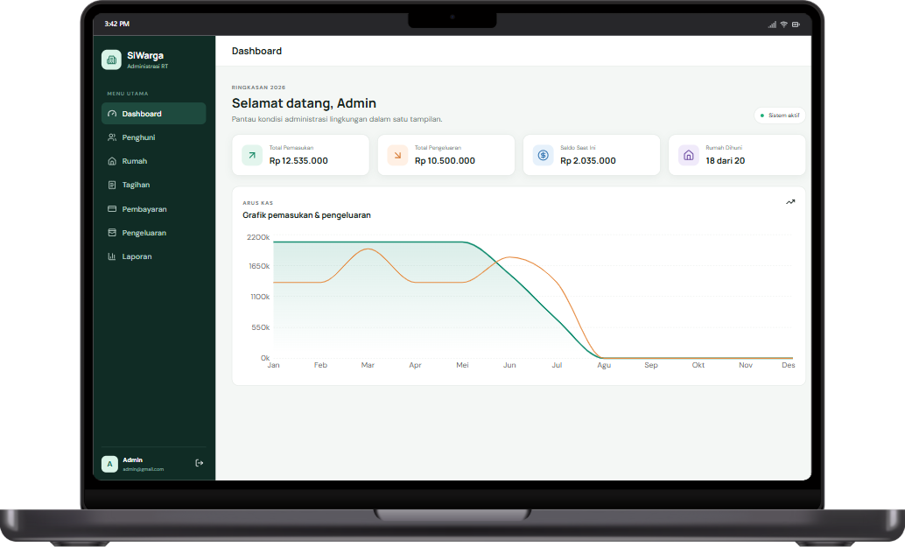 | 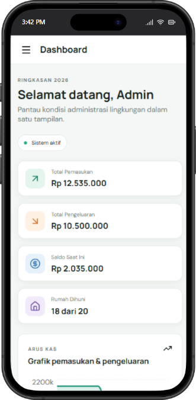 |

## 3. Penghuni

Pengelolaan identitas penghuni tetap dan kontrak, termasuk nomor telepon, status pernikahan, dan foto KTP privat.

| Desktop | Mobile |
|---|---|
| 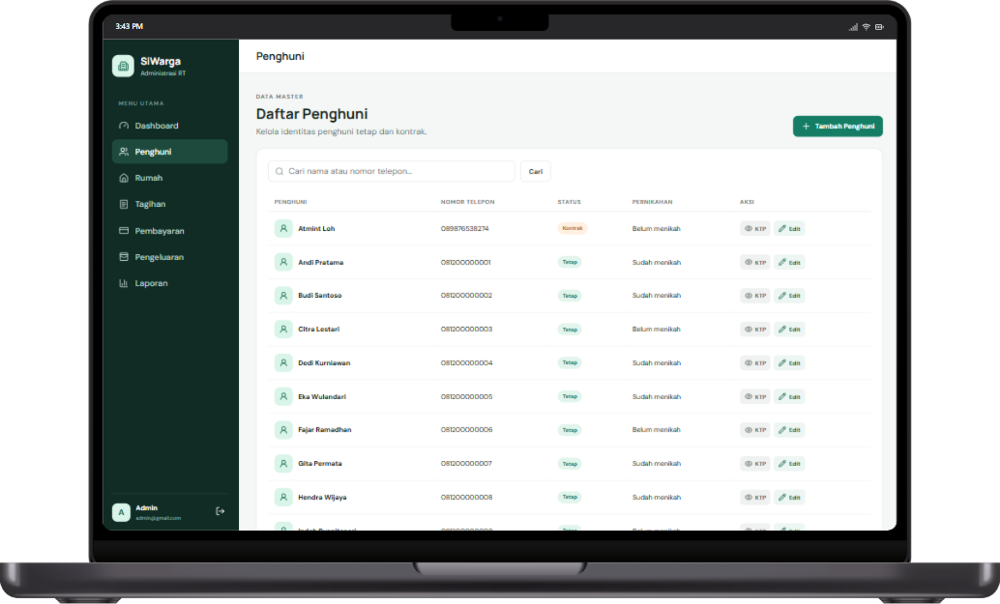 | 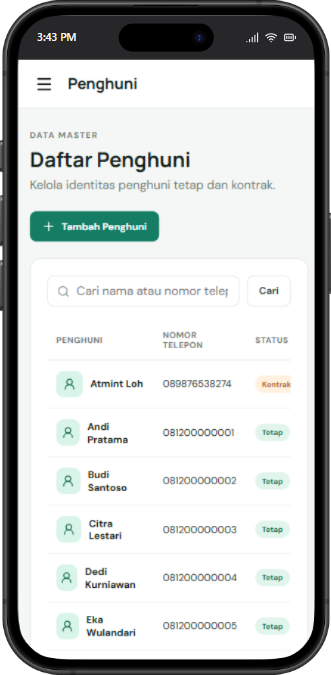 |

## 4. Rumah

Daftar 20 rumah yang menampilkan status dihuni atau tidak dihuni, penghuni aktif, jenis penghuni tetap atau kontrak, serta akses menuju detail dan riwayat rumah.

| Desktop | Mobile |
|---|---|
| 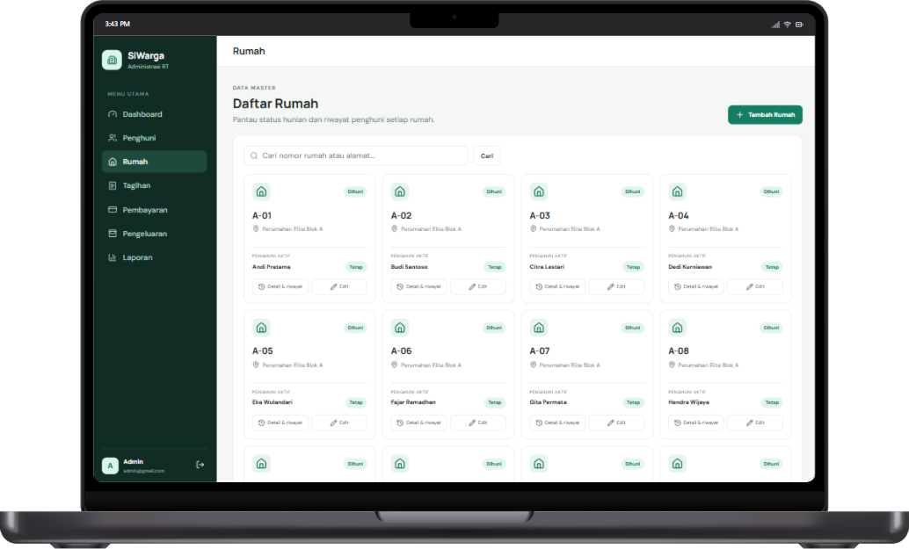 | 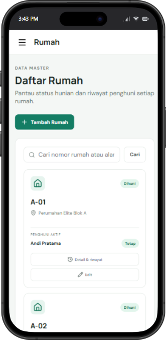 |

## 5. Riwayat Penghuni dan Pembayaran Rumah

Detail rumah yang memperlihatkan penghuni aktif, riwayat pergantian penghuni, serta histori tagihan dan status pembayarannya.

| Desktop | Mobile |
|---|---|
| 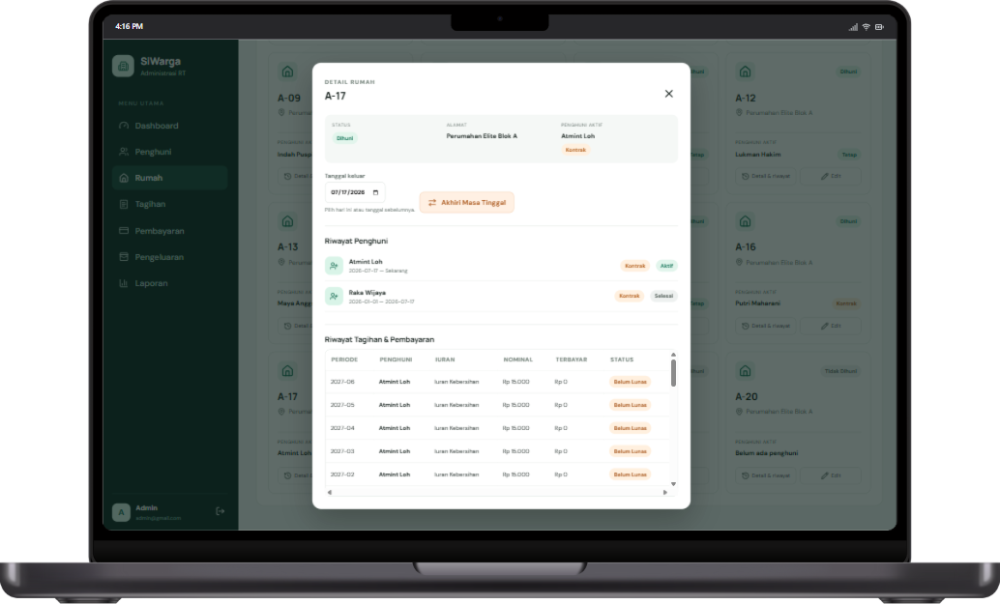 | 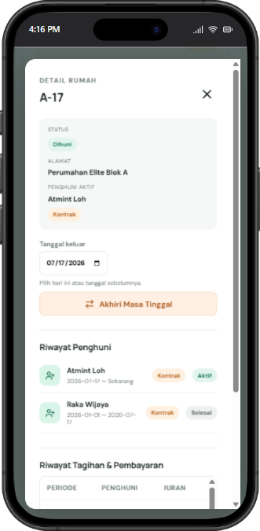 |

## 6. Tagihan

Pembuatan dan pemantauan tagihan satpam serta kebersihan berdasarkan periode dan status pelunasan.

| Desktop | Mobile |
|---|---|
| 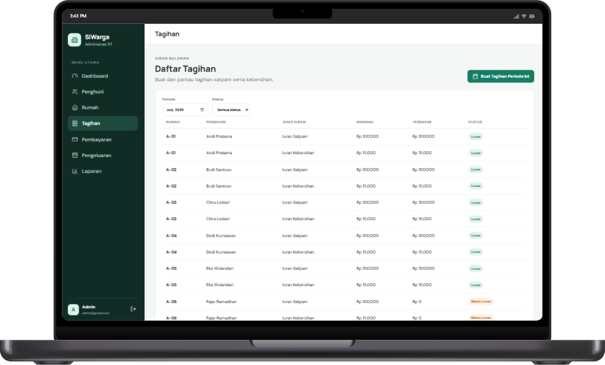 | 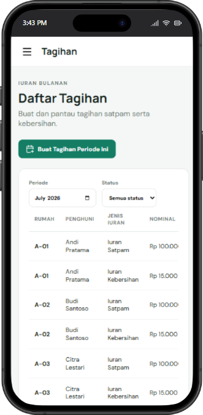 |

## 7. Pembayaran

Pencatatan pelunasan satu atau beberapa tagihan dalam satu transaksi beserta riwayat pembayar, rumah, tanggal, nomor bukti, dan total pembayaran.

| Desktop | Mobile |
|---|---|
| 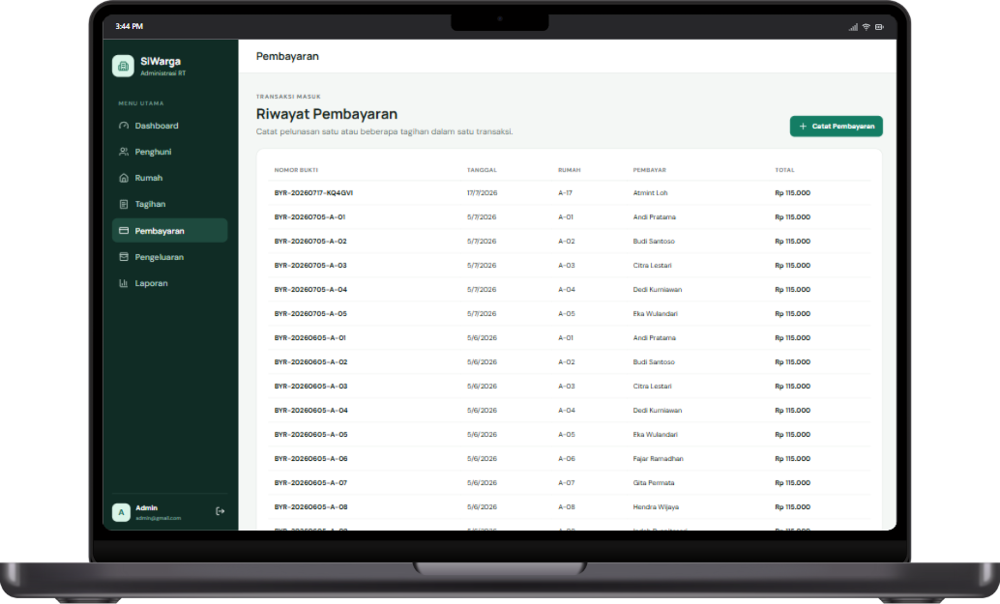 | 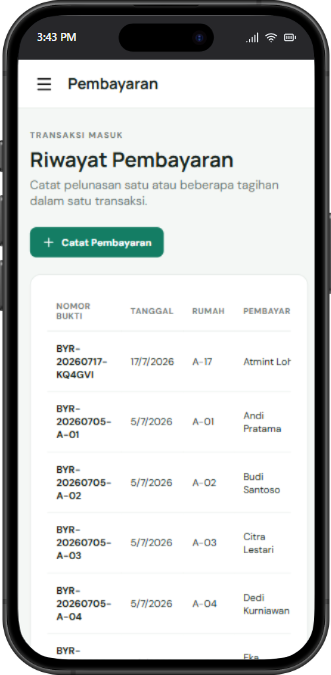 |

## 8. Pengeluaran

Pencatatan dan perubahan biaya rutin maupun tidak rutin, seperti gaji satpam, token listrik pos satpam, dan perbaikan fasilitas.

| Desktop | Mobile |
|---|---|
| 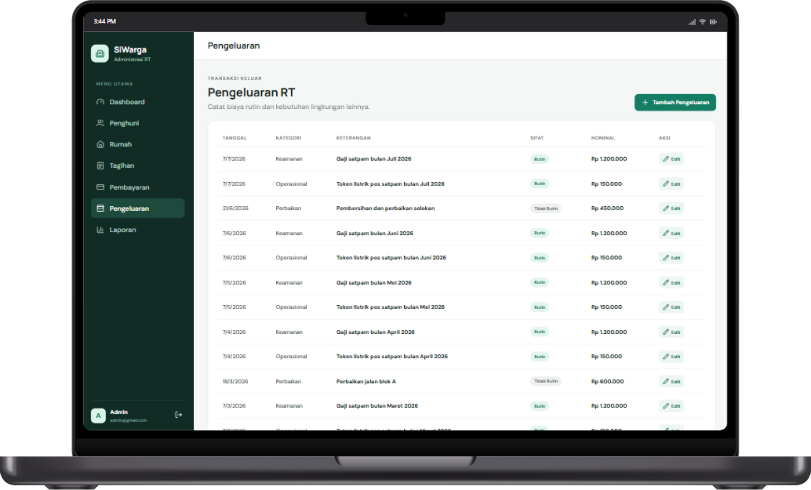 | 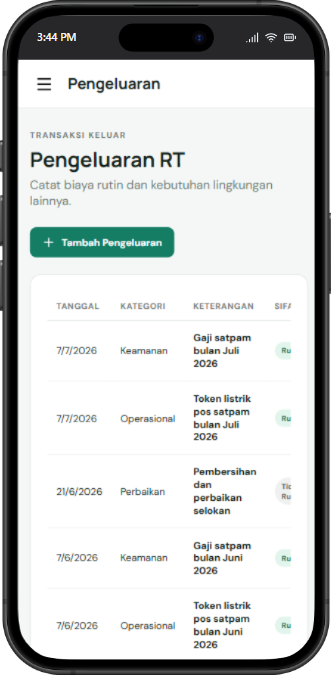 |

## 9. Laporan

Ringkasan pemasukan, pengeluaran, dan saldo akhir; grafik selama 12 bulan; serta detail transaksi untuk bulan yang dipilih.

| Desktop | Mobile |
|---|---|
| 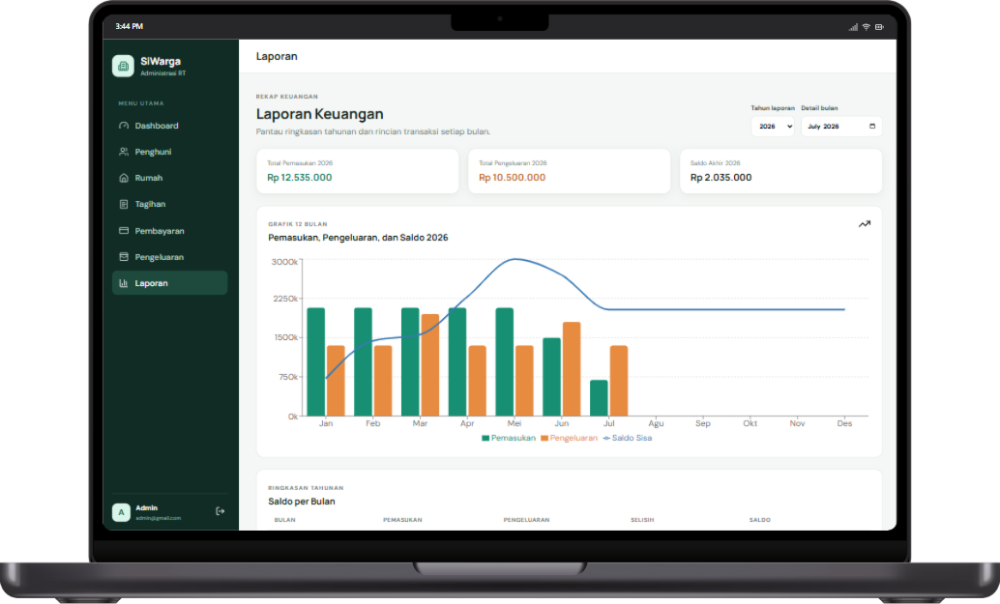 | 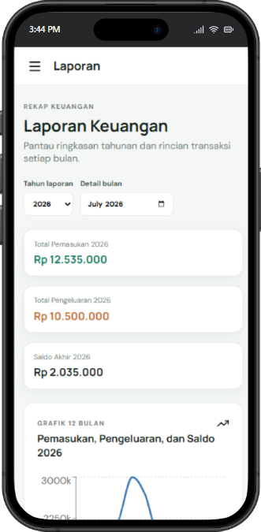 |
